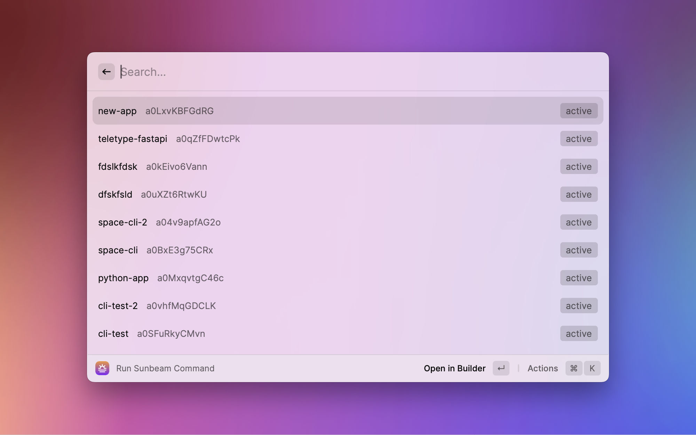

# Raycast Integration for Sunbeam

Wire Raycast UI to the Sunbeam Extension API.

Extends raycast with any language, and share your extensions with windows and linux users.

## Requirements

- [sunbeam](https://github.com/pomdtr/sunbeam)
